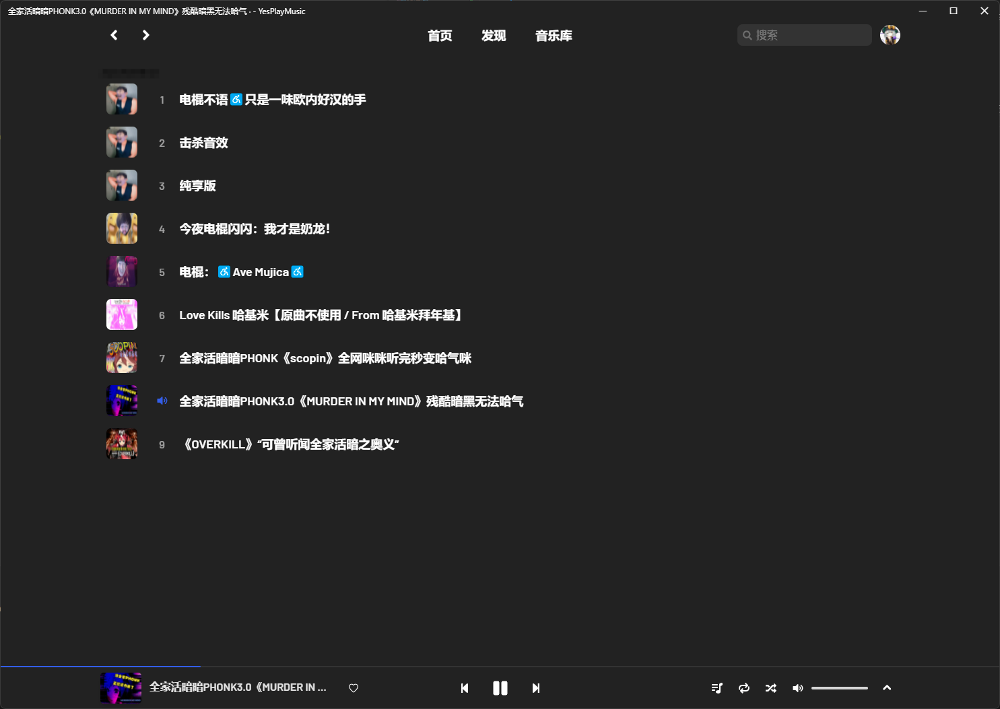

# yesplaymusic-b23 fork

使用[bilibili-audio-server](https://github.com/scarletborder/bilibili-audio-server)

## 使用方式

1. bilibili 扫码登录
    点击app右上角的头像-设置-自定义-bilibili,点击开启登录事务，使用Bilibili手机客户端扫出现的二维码，即可完成登录
    

2. 现在音乐库会多出b23的选项，点击后即可选择自己的收藏夹播放自己的音乐
    

3. 点击音乐item进行播放，由于bilibili返回的是MPEG-DASH的音频流，疑似howler无法控制播放进度（空降进度和切换暂停）。但是仍然可以进行切歌等播放列表操作
    

## 未实现的功能

无法控制bili音乐播放进度，无法对来自bilibili的音乐使用Yesplaymusic原版的部分和网易云音乐高度关联的功能，如加入喜欢音乐等。

没有做在bili fav页面的右键菜单