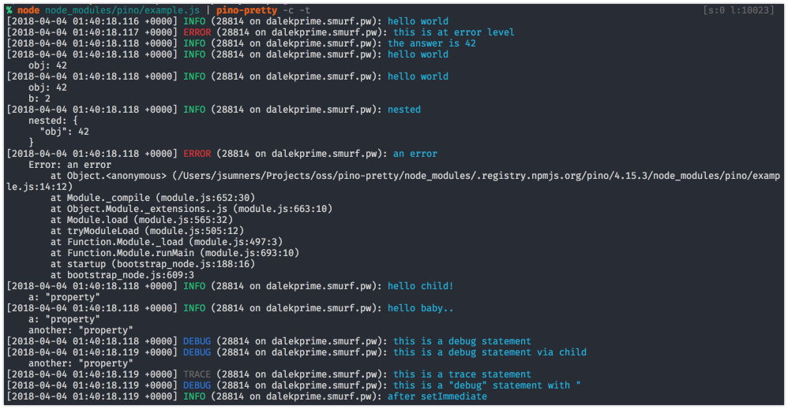

<a id="intro"></a>
# pino-pretty

[](https://www.npmjs.com/package/pino-pretty)
[](https://github.com/pinojs/pino-pretty/actions?query=workflow%3ACI)
[](https://snyk.io/test/github/pinojs/pino-pretty)
[](https://coveralls.io/github/pinojs/pino-pretty?branch=master)
[](https://standardjs.com/)

This module provides a basic [ndjson](http://ndjson.org/) formatter. If an
incoming line looks like it could be a log line from an ndjson logger, in
particular the [Pino](https://getpino.io/) logging library, then it will apply
extra formatting by considering things like the log level and timestamp.

A standard Pino log line like:

```
{"level":30,"time":1522431328992,"msg":"hello world","pid":42,"hostname":"foo","v":1}
```

Will format to:

```
[1522431328992] INFO (42 on foo): hello world
```

If you landed on this page due to the deprecation of the `prettyPrint` option
of `pino`, read the [Programmatic Integration](#integration) section.

<a id="example"></a>
## Example

Using the [example script][exscript] from the Pino module, and specifying
that logs should be colored and the time translated, we can see what the
prettified logs will look like:



[exscript]: https://github.com/pinojs/pino/blob/fc4c83b/example.js

<a id="install"></a>
## Install

```sh
$ npm install -g pino-pretty
```

<a id="usage"></a>
## Usage

It is recommended to use `pino-pretty` with `pino`
by piping output to the CLI tool:

```sh
node app.js | pino-pretty
```

<a id="cliargs"></a>
### CLI Arguments

- `--colorize` (`-c`): Adds terminal color escape sequences to the output.
- `--crlf` (`-f`): Appends carriage return and line feed, instead of just a line
  feed, to the formatted log line.
- `--errorProps` (`-e`): When formatting an error object, display this list
  of properties. The list should be a comma-separated list of properties Default: `''`.
  Do not use this option if logging from pino@7. Support will be removed from future verions.
- `--levelFirst` (`-l`): Display the log level name before the logged date and time.
- `--errorLikeObjectKeys` (`-k`): Define the log keys that are associated with
  error like objects. Default: `err,error`.
- `--messageKey` (`-m`): Define the key that contains the main log message.
  Default: `msg`.
- `--levelKey` (`--levelKey`): Define the key that contains the level of the log.
  Default: `level`.
- `--levelLabel` (`-b`): Output the log level using the specified label.
  Default: `levelLabel`.
- `--minimumLevel` (`-L`): Hide messages below the specified log level. Accepts a number, `trace`, `debug`, `info`, `warn`, `error`, or `fatal`. If any more filtering is required, consider using [`jq`](https://stedolan.github.io/jq/).
- `--customLevels` (`-x`): Override default levels with custom levels, e.g. `-x err:99,info:1`
- `--customColors` (`-X`): Override default colors with custom colors, e.g. `-X err:red,info:blue`
- `--useOnlyCustomProps` (`-U`): Only use custom levels and colors (if provided) (default: true); else fallback to default levels and colors, e.g. `-U false`
- `--messageFormat` (`-o`): Format output of message, e.g. `{levelLabel} - {pid} - url:{request.url}` will output message: `INFO - 1123 - url:localhost:3000/test`
  Default: `false`
- `--timestampKey` (`-a`): Define the key that contains the log timestamp.
  Default: `time`.
- `--translateTime` (`-t`): Translate the epoch time value into a human-readable
  date and time string. This flag also can set the format string to apply when
  translating the date to a human-readable format. For a list of available pattern
  letters, see the [`dateformat` documentation](https://www.npmjs.com/package/dateformat).
  - The default format is `yyyy-mm-dd HH:MM:ss.l o` in UTC.
  - Require a `SYS:` prefix to translate time to the local system's time zone. A
    shortcut `SYS:standard` to translate time to `yyyy-mm-dd HH:MM:ss.l o` in
    system time zone.
- `--ignore` (`-i`): Ignore one or several keys, nested keys are supported with each property delimited by a dot character (`.`),
  keys may be escaped to target property names that contains the delimiter itself:
  (`-i time,hostname,req.headers,log\\.domain\\.corp/foo`)
- `--hideObject` (`-H`): Hide objects from output (but not error object)
- `--singleLine` (`-S`): Print each log message on a single line (errors will still be multi-line)
- `--config`: Specify a path to a config file containing the pino-pretty options.  pino-pretty will attempt to read from a `.pino-prettyrc` in your current directory (`process.cwd`) if not specified

<a id="integration"></a>
## Programmatic Integration

We recommend against using `pino-pretty` in production and highly
recommend installing `pino-pretty` as a development dependency.

Install `pino-pretty` alongside `pino` and set the transport target to `'pino-pretty'`:

```js
const pino = require('pino')
const logger = pino({
  transport: {
    target: 'pino-pretty'
  },
})

logger.info('hi')
```

The transport option can also have an options object containing `pino-pretty` options:

```js
const pino = require('pino')
const logger = pino({
  transport: {
    target: 'pino-pretty',
    options: {
      colorize: true
    }
  }
})

logger.info('hi')
```

Use it as a stream:

```js
const pino = require('pino')
const pretty = require('pino-pretty')
const logger = pino(pretty())

logger.info('hi')
```

Options are also supported:

```js
const pino = require('pino')
const pretty = require('pino-pretty')
const stream = pretty({
  colorize: true
})
const logger = pino(stream)

logger.info('hi')
```

See the [Options](#options) section for all possible options.


### Usage as a stream

If you are using `pino-pretty` as a stream and you need to provide options to `pino`,
pass the options as the first argument and `pino-pretty` as second argument:

```js
const pino = require('pino')
const pretty = require('pino-pretty')
const stream = pretty({
  colorize: true
})
const logger = pino({ level: 'info' }, stream)

// Nothing is printed
logger.debug('hi')
```

### Usage with Jest

Logging with Jest is _problematic_, as the test framework requires no asynchronous operation to
continue after the test has finished. The following is the only supported way to use this module
with Jest:

```js
import pino from 'pino'
import pretty from 'pino-pretty'

test('test pino-pretty', () => {
  const logger = pino(pretty({ sync: true }));
  logger.info('Info');
  logger.error('Error');
});
```

### Handling non-serializable options

Using the new [pino v7+
transports](https://getpino.io/#/docs/transports?id=v7-transports) not all
options are serializable, for example if you want to use `messageFormat` as a
function you will need to wrap `pino-pretty` in a custom module.

Executing `main.js` below will log a colorized `hello world` message using a
custom function `messageFormat`:

```js
// main.js
const pino = require('pino')

const logger = pino({
  transport: {
    target: './pino-pretty-transport',
    options: {
      colorize: true
    }
  },
})

logger.info('world')
```

```js
// pino-pretty-transport.js
module.exports = opts => require('pino-pretty')({
  ...opts,
  messageFormat: (log, messageKey) => `hello ${log[messageKey]}`
})
```

<a id="options"></a>
### Options

The options accepted have keys corresponding to the options described in [CLI Arguments](#cliargs):

```js
{
  colorize: colorette.isColorSupported, // --colorize
  crlf: false, // --crlf
  errorLikeObjectKeys: ['err', 'error'], // --errorLikeObjectKeys
  errorProps: '', // --errorProps
  levelFirst: false, // --levelFirst
  messageKey: 'msg', // --messageKey
  levelKey: 'level', // --levelKey
  messageFormat: false, // --messageFormat
  timestampKey: 'time', // --timestampKey
  translateTime: false, // --translateTime
  ignore: 'pid,hostname', // --ignore
  hideObject: false, // --hideObject
  singleLine: false, // --singleLine

  // The file or file descriptor (1 is stdout) to write to
  destination: 1,

  // Alternatively, pass a `sonic-boom` instance (allowing more flexibility):
  // destination: new SonicBoom({ dest: 'a/file', mkdir: true })

  // You can also configure some SonicBoom options directly
  sync: false, // by default we write asynchronously
  append: true, // the file is opened with the 'a' flag
  mkdir: true, // create the target destination


  customPrettifiers: {}
}
```

The `colorize` default follows
[`colorette.isColorSupported`](https://github.com/jorgebucaran/colorette#iscolorsupported).

The defaults for `sync`, `append`, `mkdir` inherit from
[`SonicBoom(opts)`](https://github.com/pinojs/sonic-boom#API).

`customPrettifiers` option provides the ability to add a custom prettify function
for specific log properties. `customPrettifiers` is an object, where keys are
log properties that will be prettified and value is the prettify function itself.
For example, if a log line contains a `query` property,
you can specify a prettifier for it:

```js
{
  customPrettifiers: {
    query: prettifyQuery
  }
}
//...
const prettifyQuery = value => {
  // do some prettify magic
}
```

Additionally, `customPrettifiers` can be used to format the `time`, `hostname`, `pid`, `name`, `caller` and `level`
outputs:

```js
{
  customPrettifiers: {
    // The argument for this function will be the same
    // string that's at the start of the log-line by default:
    time: timestamp => `🕰 ${timestamp}`,

    // The argument for the level-prettifier may vary depending
    // on if the levelKey option is used or not.
    // By default this will be the same numerics as the Pino default:
    level: logLevel => `LEVEL: ${logLevel}`

    // other prettifiers can be used for the other keys if needed, for example
    hostname: hostname => colorGreen(hostname)
    pid: pid => colorRed(hostname)
    name: name => colorBlue(name)
    caller: caller => colorCyan(caller)
  }
}
```

Note that prettifiers do not include any coloring, if the stock coloring on
`level` is desired, it can be accomplished using the following:

```js
const { colorizerFactory } = require('pino-pretty')
const levelColorize = colorizerFactory(true)
const levelPrettifier = logLevel => `LEVEL: ${levelColorize(logLevel)}`
//...
{
  customPrettifiers: { level: levelPrettifier }
}
```

`messageFormat` option allows you to customize the message output. A template `string` like this can define the format:

```js
{
  messageFormat: '{levelLabel} - {pid} - url:{request.url}'
}
```

This option can also be defined as a `function` with this prototype:

```js
{
  messageFormat: (log, messageKey, levelLabel) => {
    // do some log message customization
    return customized_message;
  }
}
```

## Limitations

Because `pino-pretty` uses stdout redirection, in some cases the command may
terminate with an error due to shell limitations.

For example, currently, mingw64 based shells (e.g. Bash as supplied by [git for
Windows](https://gitforwindows.org)) are affected and terminate the process with
a `stdout is not a tty` error message.

Any PRs are welcomed!

<a id="license"></a>
## License

MIT License
